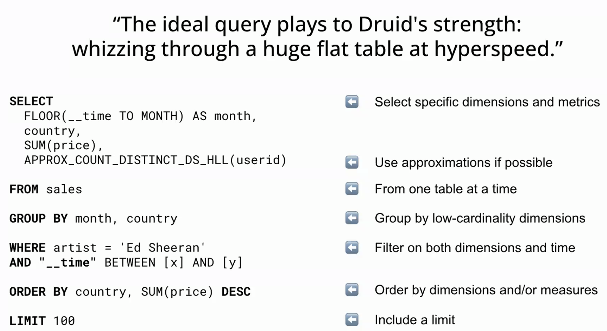

# Druid

- [Druid](#druid)
  - [2022-Sep-21](#2022-sep-21)
  - [2022-Sep-22](#2022-sep-22)
  - [Questions](#questions)

## 2022-Sep-21

- scatter-gather approach
- supports both batch and realtime ingestion
- realtime node
  - mini compaction, waits for a threshold before files are merged into larger chunk and pushed to data node
- specialized data format used for higher performance and multi level indexing
- query node
  - Preparation of query plan. data collected over the query node before responding to client
  - reducing/pruning the # of files needing to be scanned
  - locates the data
  - issue query
  - merge results
- data node
  - work per segment file is sequential
  - finer pruning at the individual file level leveraging the indexes
  - data node have working set of the data, while cloud storage would have all the data. even the data nodes could be tiered, to store more recent/frequently used data in tier-1 and slightly lesser frequent data in tier-2 and all the data in cloud storage
  - ingest data
    - stream/batch ingestion tasks
    - segment creation
    - deep storage writing
    - fresh data querying (for realtime queries)
  - store data
    - data compaction
  - respond to queries
  - components
    - middle manager
- master node
  - identifies which data node is down and start replicating it's data from cloud storage into other data nodes
  - even if master node goes down, only impact unable to identify which node goes down, but the query nodes will continue to serve the client with stale file location/data  node information until the master node comes back online
  - leader re-election once a master node goes down
  - issue tasks (ingestion)
    - monitor and manage
  - catalogue data (after ingestion)
  - monitor state
  - components
    - overlord
- MSQ Task Engine
  - multi stage query engine
  - evolution from ingestion spec JSONs
- recommendations
  - pre-join, flatten the data instead of joining at the time of querying
- upcoming new features
  - sql based ingestion
  - better handling for long running jobs, complex
  - alerting functionality for variety of conditions
- druid vs data cubing solution

## 2022-Sep-22

- <https://learn.imply.io/apache-druid-basics>
- realtime ingestion
  - task cycling
    - worker node monitors the kafka partition for an hour, then writes to deep storage, commit the offset and then shut down. Post this another worker node picks up the task and starts the job.
  - druid acts as kafka client
- merge at historical is single threaded
- data optimizations
  - data nodes are only local aware
  - segment granularity
- 

## Questions

- TBA
- historical will assign the data from deep storage to segment
- cost of caching
- supervisor
  - Used in realtime ingestion
- range partitioning
