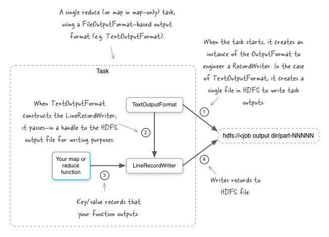
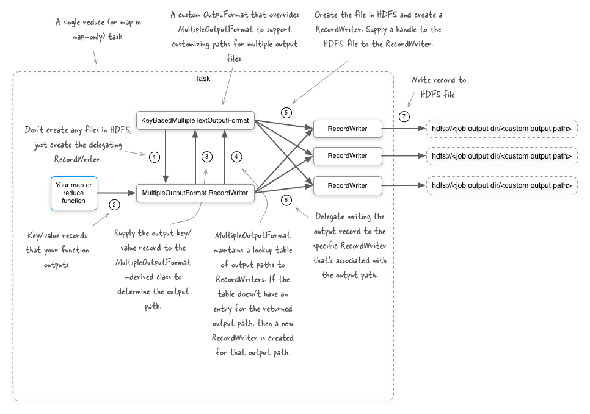
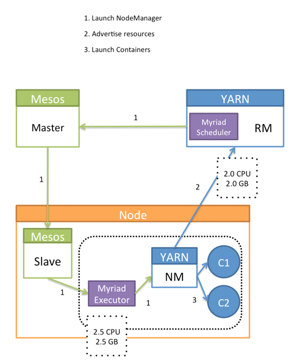
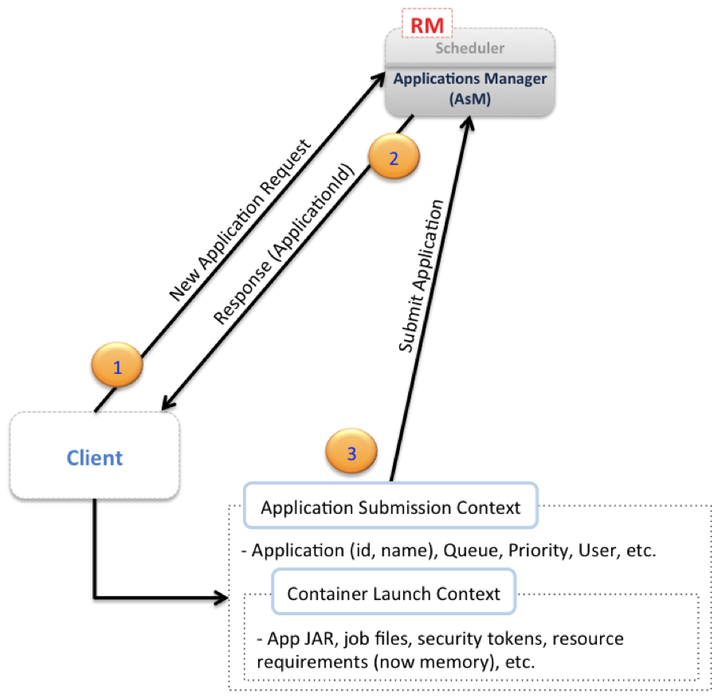
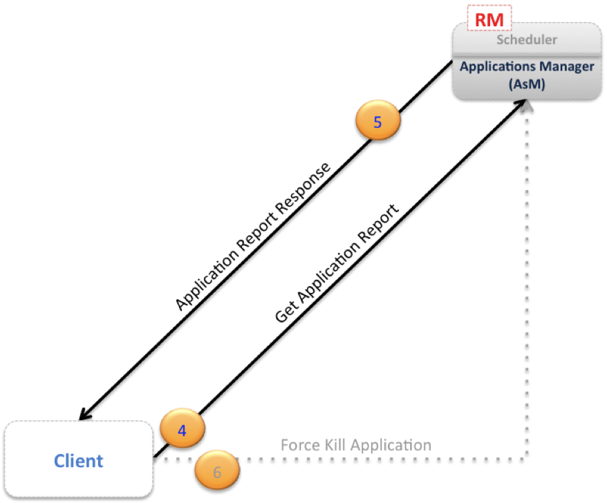
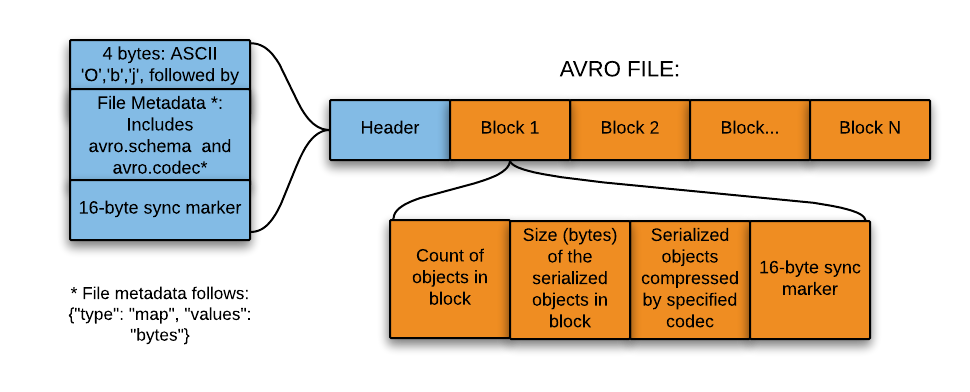
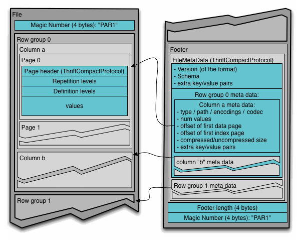
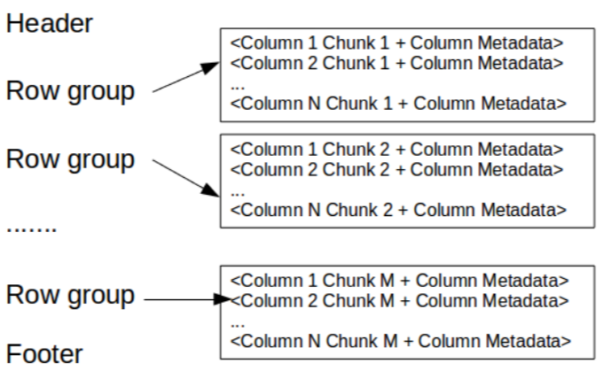
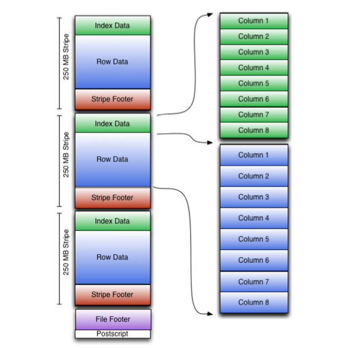

# Hadoop Theory

## Concepts

- [x] Why greater compression may not result in better performance?
  - The purpose of compression is to save space, not speed up query time. Compression actually adds overhead to decompress the data before data can be read, so I would expect the query against compressed data will be slightly slower than uncompressed. So what you see is totally normal to me.

## Hadoop MultiOutputFormat

- We have 2 options to generate multiple outputs from a Map only or a MapReduce job.
  - MultipleOutputFormat (MapReduce 1)
  - MultipleOutputs (MapReduce 1/2)
- Both the above options can be used to generate partitioned outputs from Map only jobs as well as Reduce tasks jobs
- Methods to look for when working with MultipleOutputFormat class
  - generateFileNameForKeyValue
  - getInputFileBasedOutputFileName
  - mapred.outputformat.numOfTrailingLegs
  - generateActualKey
  - generateActualValue
  - getRecordWriter

- References:
  - <http://grepalex.com/2013/05/20/multipleoutputs-part1/>
  - <http://grepalex.com/2013/07/16/multipleoutputs-part2/>

- If you are a smartass and try to output multiple type of writable objects under the pretext of SequenceFileOutput format by defining the output key/value class as parent interface of all these types, then beware. The job tries exact writable match and not any extending interface match.

- With a normal output format
  - 
- With MultipleOutputFormat
  - 

## Mesos vs YARN

- Mesos and YARN

Mesos determines which resources are available, and it makes offers back to an application scheduler (the application scheduler and its executor is called a "framework"). Those offers can be accepted or rejected by the framework. This model is considered a non-monolithic model because it is a "two-level" scheduler, where scheduling algorithms are pluggable. Mesos allows an infinite number of schedule algorithms to be developed, each with its own strategy for which offers to accept or decline, and can accommodate thousands of these schedulers running multi-tenant on the same cluster.

From <http://radar.oreilly.com/2015/02/a-tale-of-two-clusters-mesos-and-yarn.html>

- A few well known companies eBay, MapR, and Mesosphere collaborated on a project called Myriad.

This open source software project is both a Mesos framework and a YARN scheduler that enables Mesos to manage YARN resource requests. When a job comes into YARN, it will schedule it via the Myriad Scheduler, which will match the request to incoming Mesos resource offers. Mesos, in turn, will pass it on to the Mesos worker nodes. The Mesos nodes will then communicate the request to a Myriad executor which is running the YARN node manager. Myriad launches YARN node managers on Mesos resources, which then communicate to the YARN resource manager what resources are available to them. YARN can then consume the resources as it sees fit. Myriad provides a seamless bridge from the pool of resources available in Mesos to the YARN tasks that want those resources.
The beauty of this approach is that not only does it allow you to elastically run YARN workloads on a shared cluster, but it actually makes YARN more dynamic and elastic than it was originally designed to be. This approach also makes it easy for a data center operations team to expand resources given to YARN (or, take them away as the case might be) without ever having to reconfigure the YARN cluster. It becomes very easy to dynamically control your entire data center. This model also provides an easy way to run and manage multiple YARN implementations, even different versions of YARN on the same cluster.


From <http://radar.oreilly.com/2015/02/a-tale-of-two-clusters-mesos-and-yarn.html>

## Kerberos

- Request a ticket
  - `kinit m111111111@XYZ.ABCD.COM`

- Create a keytab

```bash
  ktutil
  ktutil:  addent -password -p m1111111@XYZ.ABCD.COM -k 1 -e rc4-hmac
  Password for m0111111111@XYZ.ABCD.COM:
  ktutil:  write_kt example.keytab
  ktutil:  exit
```

- Use a keytab
  - `kinit -kt example.keytab m0173628@XYZ.ABCD.COM`

- MicroNugget: How Does Kerberos Work?
  - <https://www.youtube.com/watch?v=kp5d8Yv3-0c>

- Key components of Kerberos Authentication setup
  - Client (C)
  - File Server (F)
  - Key Distribution Center (KDC) - Domain Controller
  - Authenticator Key (AK)
  - Ticket Granting Ticket (TGT)
  - Kerberos Tray (KT)
  - Ticket (T)
- Steps involved in Authentication

|     |         |     |
| --- | ------- | --- |
| C   | ->(AK)  | KDC |
| KDC | ->(TGT) | C   |
| C   | ->(TGT) | KDC |
| KDC | ->(T)   | C   |
| C   | ->(T)   | FS  |

- Explaining of Kerberos principles in a more elaborate manner
  - <http://www.roguelynn.com/words/explain-like-im-5-kerberos/>
- Kerberos has built in mechanism to prevent against 'replay attacks'
  - This is done using Authenticator
  - This works by using time based validation that a request has timestamp greater than the last request.
  - ref: <http://windowsitpro.com/active-directory/understanding-how-kerberos-authentication-protects-against-replay-attacks>
- Working with kerberos in Java API via UserGroupInformation
- Install kerberos on Windows
  - <https://confluence.wxxx.com/display/ISDEMIB/Setting+Up+Windows+MIT+Kerberos+for+ODBC+Connections+to+Hive>

## What is YARN

- What is YARN?

YARN stands for "Yet-Another-Resource-Negotiator". It is a framework that facilitates writing arbitrary distributed processing frameworks and applications.
YARN provides the daemons and APIs necessary to develop generic distributed applications of any kind, handles and schedules resource requests (such as memory and CPU) from such applications, and supervises their execution.
YARN's execution model is more generic than the earlier MapReduce implementation. YARN can run applications that do not follow the MapReduce model, unlike the original Apache Hadoop MapReduce (also called MR1).

- What is MR2?

With the advent of YARN, there is no longer a single JobTracker to run jobs and a TaskTracker to run tasks of the jobs. The old MR1 framework was rewritten to run within a submitted application on top of YARN. This application was christened MR2, or MapReduce version 2. It is the familiar MapReduce execution underneath, except that each job now controls its own destiny via its own ApplicationMaster taking care of execution flow (such as scheduling tasks, handling speculative execution and failures, etc.). It is a more isolated and scalable model than the MR1 system where a singular JobTracker does all the resource management, scheduling and task monitoring work.

YARN is a generic platform for any form of distributed application to run on, while MR2 is one such distributed application that runs the MapReduce framework on top of YARN

In a YARN cluster, there are two types of hosts:

- The ResourceManager is the master daemon that communicates with the client, tracks resources on the cluster, and orchestrates work by assigning tasks to NodeManagers.
- A NodeManager is a worker daemon that launches and tracks processes spawned on worker hosts.

There is a single Resource Manager, which has two main services:

- A pluggable Scheduler, which manages and enforces the resource scheduling policy in the cluster.  Note that, at the time of writing this blog post, there are two schedulers supported in Hadoop 0.23, the defaultFIFO scheduler and the Capacity scheduler; the Fair Scheduler is not yet supported.
- An Applications Manager (AsM), which manages running Application Masters in the cluster, i.e., it is responsible for starting application masters and for monitoring and restarting them on different nodes in case of failures.

An application in YARN comprises three parts:

- The Application client, which is how a program is run on the cluster.
- An ApplicationMaster which provides YARN with the ability to perform allocation on behalf of the application.
- One or more tasks that do the actual work (runs in a process) in the container allocated by YARN.

### Resource Allocation Model

In earlier Hadoop versions, each node in the cluster was statically assigned the capability of running a predefined number of Map slots and a predefined number of Reduce slots. The slots could not be shared between Maps and Reduces. This static allocation of slots wasn't optimal since slot requirements vary during the MR job life cycle (typically, there is a demand for Map slots when the job starts, as opposed to the need for Reduce slots towards the end). Practically, in a real cluster, where jobs are randomly submitted and each has its own Map/Reduce slots requirement, having an optimal utilization of the cluster was hard, if not impossible.
The resource allocation model in Hadoop 0.23 addresses such deficiency by providing a more flexible resource modelling. Resources are requested in the form of containers, where each container has a number of non-static attributes. At the time of writing this blog, the only supported attribute was memory (RAM). However, the model is generic and there is intention to add more attributes in future releases (e.g. CPU and network bandwidth). In this new Resource Management model, only a minimum and a maximum for each attribute are defined, and AMs can request containers with attribute values as multiples of these minimums.
From <http://blog.cloudera.com/blog/2012/02/mapreduce-2-0-in-hadoop-0-23/>

YARN currently defines two resources, vcores and memory. Each NodeManager tracks its own local resources and communicates its resource configuration to the ResourceManager, which keeps a running total of the cluster's available resources. By keeping track of the total, the ResourceManager knows how to allocate resources as they are requested. (Vcore has a special meaning in YARN. You can think of it simply as a "usage share of a CPU core." If you expect your tasks to be less CPU-intensive (sometimes called I/O-intensive), you can set the ratio of vcores to physical cores higher than 1 to maximize your use of hardware resources.)

In Hadoop 2, MapReduce is split into two components: The cluster resource management capabilities have become YARN, while the MapReduce-specific capabilities remain MapReduce. In the former MR1 architecture, the cluster was managed by a service called the JobTracker. TaskTracker services lived on each node and would launch tasks on behalf of jobs. The JobTracker would serve information about completed jobs. In MR2, the functions of the JobTracker are divided into three services. The ResourceManager is a persistent YARN service that receives and runs applications (a MapReduce job is an application) on the cluster. It contains the scheduler, which, as in MR1, is pluggable.
The MapReduce-specific capabilities of the JobTracker have moved into the MapReduce Application Master, one of which is started to manage each MapReduce job and terminated when the job completes. The JobTracker's function of serving information about completed jobs has been moved to the JobHistoryServer. The TaskTracker has been replaced with the NodeManager, a YARN service that manages resources and deployment on a node. NodeManager is responsible for launching containers, each of which can house a map or reduce task.

An MR2 job submission includes the amount of resources to reserve for each map and reduce task. As in MR1, the amount of memory requested is controlled by the mapreduce.map.memory.mb and mapreduce.reduce.memory.mb properties. MR2 also adds additional parameters that control how much processing power to reserve for each task. The mapreduce.map.cpu.vcores and mapreduce.reduce.cpu.vcores properties express how much parallelism a map or reduce task can utilize. These should be kept at their default of 1 unless your code is explicitly spawning extra compute-intensive threads.

### MapReduce 2.0 Main Components

In this section, we'll go through the main components of the new MapReduce architecture in detail to understand the functionality of these components and how they interact with each other.

 Client - Resource Manager
  Figure 2 illustrates the initial step for running an application on a YARN cluster. Typically a client communicates with the RM (specifically the Applications Manager component of the RM) to initiates this process. The first step, marked (1) in the diagram, is for the client to notify the Applications Manager of the desire of submitting an application, this is done via a "New Application Request". The RM response, marked (2), will typically contain a newly generated unique application ID, in addition to information about cluster resource capabilities that the client will need in requesting resources for running the application's AM.
  Using the information received from the RM, the client can construct and submit an "Application Submission Context", marked (3), which typically contains information like scheduler queue, priority and user information, in addition to information needed by the RM to be able to launch the AM. This information is contained in a "Container Launch Context", which contains the application's jar, job files, security tokens and any resource requirements.



  Fig. 2
  Following application submission, the client can query the RM for application reports, receive such reports and, if needed, the client can also ask the RM to kill the application. These three additional steps are pictorially depicted in fig. 3.


Fig. 3

 Resource Manager - Application Master
  When the RM receives the application submission context from the client, it finds an available container meeting the resource requirements for running the AM, and it contacts the NM for the container to start the AM process on this node. Figure 4 depicts the following communication steps between the AM and the RM (specifically the Scheduler component of the RM). The first step, marked (1) in the diagram, is for the AM to register itself with the RM. This step consists of a handshaking procedure and also conveys information like the RPC port that the AM will be listening on, the tracking URL for monitoring the application's status and progress, etc.
  The RM registration response, marked (2), will convey essential information for the AM master like minimum and maximum resource capabilities for this cluster. The AM will use such information in calculating and requesting any resource requests for the application's individual tasks. The resource allocation request from the AM to the RM, marked (3), mainly contains a list of requested containers, and may also contain a list of released containers by this AM. Heartbeat and progress information are also relayed through resource allocation requests as shown by arrow (4).
  When the Scheduler component of the RM receives a resource allocation request, it computes, based on the scheduling policy, a list of containers that satisfy the request and sends back an allocation response, marked (5), which contains a list of allocated resources. Using the resource list, the AM starts contacting the associated node managers (as will be soon seen), and finally, as depicted by arrow (6), when the job finishes, the AM sends a Finish Application message to the Resource Manager and exits.

Fig. 4

 Application Master - Container Manager
  Figure 5 describes the communication between the AM and the Node Managers. The AM requests the hosting NM for each container to start it as depicted by arrow (1) in the diagram. While containers are running, the AM can request and receive a container status report as shown in steps (2) and (3), respectively.

Fig. 5

Based on the above discussion, a developer writing YARN applications will be mainly concerned with the following interfaces:

- ClientRMProtocol: Client RM (Fig. 3).

This is the protocol for a client to communicate with the RM to launch a new application (i.e. an AM), check on the status of the application or kill the application.

- AMRMProtocol: AM RM (Fig. 4).

This is the protocol used by the AM to register/unregister itself with the RM, as well as to request resources from the RM Scheduler to run its tasks.

- ContainerManager: AM NM (Fig. 5).

This is the protocol used by the AM to communicate with the NM to start or stop containers and to get status updates on its containers.

From <http://blog.cloudera.com/blog/2012/02/mapreduce-2-0-in-hadoop-0-23/>

Hadoop 1 covers HDFS and MR1 (MR only)
Hadoop 2 covers HDFS and MR2 (YARN + MR)

So in Hadoop 1 the architecture was more centred around MR jobs and hence the cluster resources couldn't be shared dynamically with non MR jobs. Whereas in Hadoop 2 this has changed. With the advent of YARN, the resource management component has been decoupled from MR component and hence any application (including MR) could request and utilize cluster resources. So Hadoop 2 including improvements to HDFS also brings along fragmentation of resource management capabilities to ensure cluster resources are available to even non-MR jobs (adhering the Application Master architecture)

Other features introduced as part of Hadoop 2 are

- High availability for the HDFS NameNode, which eliminates the previous SPOF in HDFS.
- Support for filesystem snapshots in HDFS, which brings native backup and disaster recovery processes to Hadoop.
- Support for federated NameNodes, which allows for horizontal scaling of the filesystem namespace.
- Support for NFS access to HDFS, which allows HDFS to be mounted as a standard filesystem.
- Native network encryption, which secures data while in transit.
- The YARN resource management system, which provides infrastructure for the creation of new Hadoop computing paradigms beyond MapReduce. This new flexibility will serve to expand the use cases for Hadoop, as well as improve the efficiency of certain types of processing over data already stored there.
- Several performance-related enhancements, including more efficient (and secure) short-circuit local readsin HDFS.

Also noteworthy are the yarn.scheduler.minimum-allocation-mb, yarn.scheduler.minimum-allocation-vcores, yarn.scheduler.increment-allocation-mb, and yarn.scheduler.increment-allocation-vcores properties, which default to 1024, 1, 512, and 1, respectively. If you submit tasks with resource requests lower than the minimum-allocation values, their requests will be set to these values. If you submit tasks with resource requests that are not multiples of the increment-allocation values, their requests will be rounded up to the nearest increments.

## Hadoop Fair Scheduler

**YARN/MR2 vs. MR1**
YARN uses an updated terminology to reflect that it no longer just manages resources for MapReduce. From YARN's perspective, a MapReduce job is an application. YARN schedules containers for map and reduce tasks to live in. What was referred to as pools in the MR1 Fair Scheduler has been updated to queue for consistency with the capacity scheduler. An excellent and deeper explanation is available here.

**How Does it Work?**
How a Hadoop scheduler functions can often be confusing, so we'll start with a short overview of what the Fair Scheduler does and how it works.

A Hadoop scheduler is responsible for deciding which tasks get to run where and when to run them. The Fair Scheduler, originally developed at Facebook, seeks to promote fairness between schedulable entities by awarding free space to those that are the most underserved. (Cloudera recommends the Fair Scheduler for its wide set of features and ease of use, and Cloudera Manager sets it as the default. More than 95% of Cloudera's customers use it.)
More than 95% of all Cloudera customers use the Fair Scheduler in their deployments.

In Hadoop, the scheduler is a pluggable piece of code that lives inside ResourceManager (the JobTracker, in MR1) the central execution managing service. The ResourceManager is constantly receiving updates from the NodeManagers that sit on each node in the cluster, that say "What's up, here are all the tasks I was running that just completed, do you have any work for me?" The ResourceManager passes these updates to the scheduler, and the scheduler then decides what new tasks, if any, to assign to that node.

**How does the scheduler decide?**
For the Fair Scheduler, it's simple: every application belongs to a "queue", and we give a container to the queue that has the fewest resources allocated to it right now. Within that queue, we offer it to the application that has the fewest resources allocated to it right now. The Fair Scheduler supports a number of features that modify this a little, like weights on queues, minimum shares, maximum shares, and FIFO policy within queues, but the basic idea remains the same.

**Beyond MapReduce**
In MR1, the Fair Scheduler was purely a MapReduce scheduler. If you wanted to run multiple parallel computation frameworks on the same cluster, you would have to statically partition resources - or cross your fingers and hope that the resources given to a MapReduce job wouldn't also be given to something else by that framework's scheduler, causing OSes to thrash. With YARN, the same scheduler can manage resources for different applications on the same cluster, which should allow for more multi-tenancy and a richer, more diverse Hadoop ecosystem.

**Scheduling Resources, Not Slots**
A big change in the YARN Fair Scheduler is how it defines a "resource". In MR1, the basic unit of scheduling was the "slot", an abstraction of a space for a task on a machine in the cluster. Because YARN expects to schedule jobs with heterogeneous task resource requests, it instead allows containers to request variable amounts of memory and schedules based on those. Cluster resources no longer need to be partitioned into map and reduce slots, meaning that a large job can use all the resources in the cluster in its map phase and then do so again in its reduce phase. This allows for better utilization of the cluster, better treatment of tasks with high resource requests, and more portability of jobs between clusters - a developer no longer needs to worry about a slot meaning different things on different clusters; rather, they can request concrete resources to satisfy their jobs' needs. Additionally, work is being done (YARN-326) that will allow the Fair Scheduler to schedule based on CPU requirements and availability as well.
An implementation detail of this change that prevents applications from starving under this new flexibility is the notion of reserved containers. Imagine two jobs are running that each have enough tasks to saturate more than the entire cluster. One job wants each of its mappers to get 1GB, and another job wants its mappers to get 2GB. Suppose the first job starts and fills up the entire cluster. Whenever one of its task finishes, it will leave open a 1GB slot. Even though the second job deserves the space, a naive policy will give it to the first one because it's the only job with tasks that fit. This could cause the second job to be starved indefinitely.

One big change in the YARN Fair Scheduler is how it defines a "resource".

To prevent this unfortunate situation, when space on a node is offered to an application, if the application cannot immediately use it, it reserves it, and no other application can be allocated a container on that node until the reservation is fulfilled. Each node may have only one reserved container. The total reserved memory amount is reported in the ResourceManager UI. A high number means that it may take longer for new jobs to get space.

**Hierarchical Queues**
Perhaps the most significant addition to the Fair Scheduler in YARN is support for hierarchical queues. Queues may now be nested inside other queues, each queue to split the resources allotted to it among subqueues.  Queues are most often used to delineate organizational boundaries, and this now allows a topology that can better reflect organizational hierarchies. We can say that the Engineering and Marketing departments both get half the cluster and then each may split its half among sub-organizations or functions. Another common use of queues is to divide jobs by their characteristics - one queue might house long running jobs with high resource requirements, while another carves out a fast lane for time-sensitive queries. Now, we can put fast/slow lanes under every team, allowing us to concurrently account for inter-organizational fairness and intra-organizational performance requirements.
From a technical standpoint, queue hierarchies define the procedure for assigning tasks to resources when they become available. All queues descend from a queue named "root". When resources become available they are assigned to child queues of the root queue according to the typical fair scheduling policy. Then, these children distribute the resources assigned to them to their children with the same policy. When calculating current allocations for fairness, all the applications in all subqueues of a queue are considered. Applications may only be scheduled on leaf queues.

Configuring hierarchical queues is simple: Queues can be specified as children of other queues by placing them as sub-elements of their parents in the Fair Scheduler allocations file.
The following is an example allocations file (fair-scheduler.xml) that splits resources first between the high-level divisions, and second, between their teams:

```xml
  <allocations>

  <queue name="Marketing">
    <minShare>8192</minShare>

    <queue name="WebsiteLogsETL">
      <weight>1.0</weight>
    </queue>

      <queue name="CustomerDataAnalysis">
        <weight>2.0</weight>
        <queue name="FastLane">
          <weight>3.0</weight>
          <maxShare>4096</maxShare>
        </queue>
        <queue name="Regular">
        </queue>
      </queue>
    </queue>

    <queue name="Engineering">
      <queue name="ImportantProduct">
        <weight>2.0</weight>
      </queue>

      <queue name="UnimportantProduct">
        <weight>1.0</weight>
      </queue>

    </queue>

  </allocations>
```

We've given Marketing a minimum share of 8192MB, meaning that tasks from Marketing jobs will get first priority until Marketing is using at least 8192MB. We've given CustomerDataAnalysis team a fast lane that will get 3MB for every 1MB that its regular queue gets but can't fit more than 4096MB. A queue's name is now prefixed with the names of its parent queues, so the CustomerDataAnalysis team's fast lane's full name would be root.Marketing.CustomerDataAnalysis.FastLane. For easier use, we can omit the root queue prefix when referring to a queue, so we could submit an application to it with  -Dmapreduce.queue.name=Marketing.CustomerDataAnalysis.FastLane.
What's Gone in the YARN Fair Scheduler?
The YARN Fair Scheduler no longer supports moving applications between queues. Applications also may no longer be given priorities within a leaf queue. Both of these features will likely be added back in the future.
Coming Soon
The improvements described here are just a start; a number of additional features are planned for the Fair Scheduler. With multi-resource scheduling, fairness will be determined with respect to CPU usage as well as memory usage, and each queue in the hierarchy will be able to have a custom scheduling policy. Gang scheduling will allow YARN applications to request "gangs" of containers that will all be made available at the same time. Guaranteed shares will allow queues to have resources sectioned off for only their use - unlike minimum shares, other queues will not be able to occupy them, even if the queue is not using them.

From <http://blog.cloudera.com/blog/2013/06/improvements-in-the-hadoop-yarn-fair-scheduler/>

## Secondary Sorting

- Hadoop secondary sorting allows us to sort the reducer keys to get desired value at the top of the value Iterator
- We use following components to achieve this
  - Composite key having both the natural key part and the sorting attribute part
  - Custom partitioner to ensure despite having a varying composite key all the records having the same set of natural keys go to the same reducer
  - Group Comparator to ensure all the composite_key-value pairs having the same natural key are grouped together before being passed to the same reducer. They will for a single composite_key and value Iterator call to reduce()
  - Custom Key Comparator to ensure the composite keys get sorted both by natural key order and the sorting_component order
- After implementing the above 4 points, we can ensure that the desired value appears at the top of Iterator in Reducers thereby saving us additional performance hit due to having to store and sort all the data in the reducer
- Using a combiner here can help reduce I/O even more during shuffle phase and speed up the process
- <https://pkghosh.wordpress.com/2011/04/13/map-reduce-secondary-sort-does-it-all/> (good explanation)
- <https://vangjee.wordpress.com/2012/03/20/secondary-sorting-aka-sorting-values-in-hadoops-mapreduce-programming-paradigm/> (newer API)

<https://community.hortonworks.com/questions/14328/what-is-the-difference-between-partitioner-combine.html>
Ok that was actually interesting so I had a look into the code. For open source projects always the definitive source:

You can find most of it in the MapTask class.

- Map Phase is run, output goes into Sorting Collector or DirectCollector ( latter if no reduce tasks )
- The write already uses the partitioner, i.e. data is partitioned when going into the Sorting Collector
- Sorting Collector is a class called MapOutputBuffer
- In here we have a combiner class and a Sorting class. Data is sorted in a memory buffer and then spilled.
- First data is sorted using the sort buffer then written to disc either directly OR using the CombinerRunner and then writing it. Combiner is also used in the Merge phase when spilled files are merged together into one output file

So the correct answer is They do not happen "after" each other, they happen together. While output data is written it is partitioned sorted, spilled and combined, merged and combined again. Hope that helps. If you want more information just have a look into the code yourself. Its quite readable.

## File Formats

- <https://blog.clairvoyantsoft.com/big-data-file-formats-3fb659903271>
- Benefits of choosing the right format
  - Faster read times
  - Faster write times
  - Splittable files
  - Schema evolution support
  - Advanced compression support
- AVRO
  - Row based format
  - Widely used as serialization platform
  - Schema stored in JSON format, making it easily accessible by any program
  - Data stored in binary format
  - Language neutral data serialization. compatible with many languages e.g. C, C++, Java, Python
  - Good fit for schema evolution. Since schema is stored with the file, hence any changes in the source system schema can be easily communicated to the downstream systems
  -
- Parquet
  - Good fit for nested data structures
  - It is especially good for queries which read particular columns from a "wide" (with many columns) table since only needed columns are read and IO is minimized.
  - Parquet format uses the record shredding and assembly algorithm for storing nested structures in columnar fashion.
  - 
  - Key Concepts
    - Row group: A logical horizontal partitioning of the data into rows. A row group consists of a column chunk for each column in the dataset.
    - Column chunk: A chunk of the data for a particular column. These column chunks live in a particular row group and is guaranteed to be contiguous in the file.
    - Page: Column chunks are divided up into pages written back to back. The pages share a common header and readers can skip over page they are not interested in.
      - 
    - Footer contains the following-
      - File metadata: The file metadata contains the locations of all the column metadata start locations. Readers are expected to first read the file metadata to find all the column chunks they are interested in. The columns chunks should then be read sequentially. It also includes the format version, the schema, any extra key-value pairs.
      - length of file metadata (4-byte)
      - magic number "PAR1" (4-byte)
- ORC
  - It ideally stores data compact and enables skipping over irrelevant parts without the need for large, complex, or manually maintained indices.
  - Advantages
    - A single file as the output of each task, which reduces the NameNode's load
    - Hive type support including datetime, decimal, and the complex types (struct, list, map, and union)
    - Concurrent reads of the same file using separate RecordReaders
    - Ability to split files without scanning for markers
    - Bound the amount of memory needed for reading or writing
    - Metadata stored using Protocol Buffers, which allows the addition and removal of fields
    - 
  - Content of file
    - Stripe - Group of rows. Default stripe size is 250M
      - Stripe footer
        - contains a directory of stream locations
      - Row data
        - used in table scans
      - Index data
        - includes min and max values for each column and the row positions within each column. ORC indexes are used only for the selection of stripes and row groups and not for answering queries
    - File Footer - Auxiliary information
      - list of stripes in the file
      - number of rows per stripe
      - each column's data type
      - column-level aggregates count, min, max, and sum
    - Postscript
      - Compression Parameter
      - Size of compressed footer
- AVRO vs PARQUET
  - AVRO is a row based storage format whereas PARQUET is a columnar based storage format.
  - PARQUET is much better for analytical querying i.e. reads and querying are much more efficient than writing.
  - Write operations in AVRO are better as compared to in PARQUET.
  - AVRO is much matured than PARQUET when it comes to schema evolution. PARQUET only supports schema append whereas AVRO supports much featured schema evolution i.e. adding or modifying columns.
  - PARQUET is ideal for querying subset of columns in a multi column table. AVRO is ideal in case of ETL operations where we need to query all the columns.
- ORC vs PARQUET
  - PARQUET is more capable of storing nested data
  - ORC is more capable of Predicate Pushdown
  - ORC supports ACID properties
  - ORC is more compression efficient
