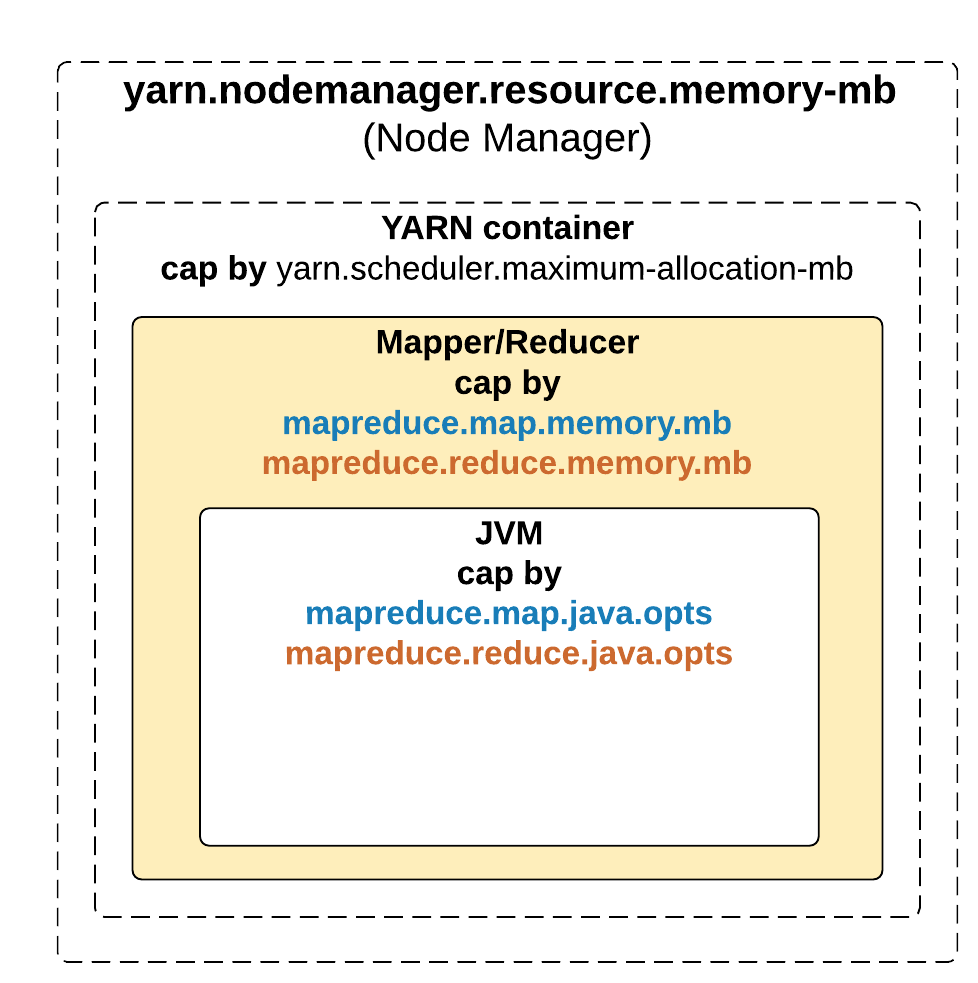
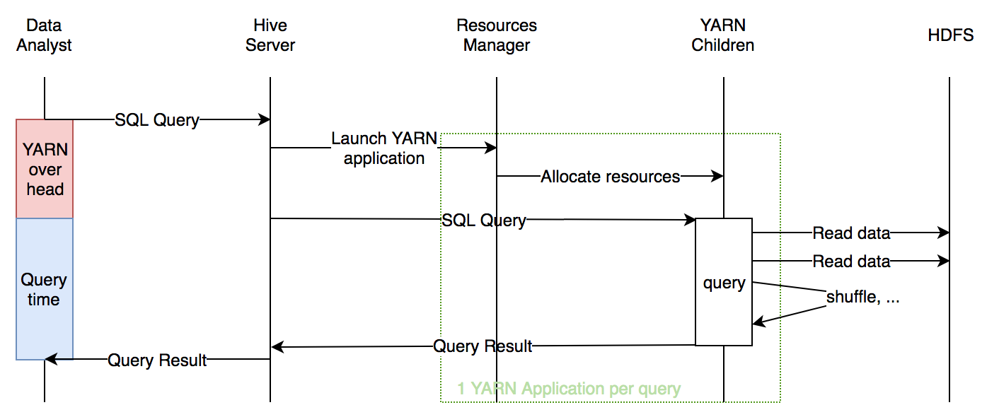
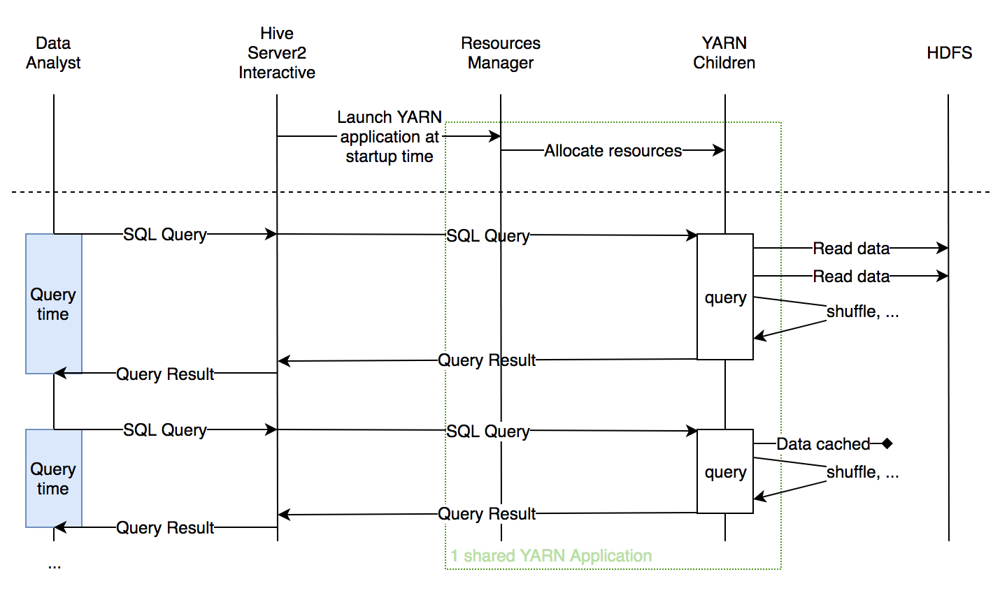
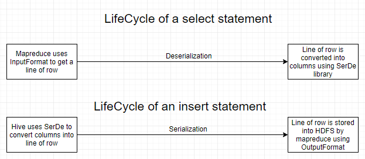

# HIVE Fundamentals

- COALESCE vs NVL
  - In case of coalesce, the expressions are evaluated from left to right and at the first non-null expression evaluation stops. Whereas in case of NVL, both the expressions get evaluated and the first non-null value is returned
  - Coalesce supports multi parameters, whereas NVL supports only binary parameter
  - Coalesce expects consistent datatypes i.e. both expressions must return same datatype. Whereas NVL does implicit conversion to left expression's datatype.

- <https://documentation.altiscale.com/heapsize-for-mappers-and-reducers>
- Heap size properties for MR engine
  - you should ensure that the heap you specify in mapreduce.{map|reduce}.java.opts is set to be less than the memory specified by mapreduce.{map|reduce}.memory.mb.
  - The two properties `yarn.nodemanager.resource.memory-mb` and `yarn.scheduler.maximum-allocation-mb` cannot be set by customers.
  -
- Heap size properties for TEZ execution engine
  - `SET hive.tez.container.size=<numerical memory value>`  Sets the size of the container spawned by YARN.
  - `SET hive.tez.java.opts=-Xmx<numerical max heap size>m`  Java command line options for Tez.
  - "hive.tez.container.size" and "hive.tez.java.opts" are the parameters that alter Tez memory settings in Hive. If "hive.tez.container.size" is set to "-1" (default value), it picks the value of "mapreduce.map.memory.mb". If "hive.tez.java.opts" is not specified, it relies on the "mapreduce.map.java.opts" setting.  Thus, if Tez specific memory settings are left as default values, memory sizes are picked from mapreduce mapper memory settings "mapreduce.map.memory.mb".
- Setting heap-size for HiveServer2 sessions
  - `jdbc:hive2://localhost:10000/default?mapreduce.map.memory.mb=3809;mapreduce.map.java.opts=-Xmx3428m;mapreduce.reduce.memory.mb=2560;mapreduce.reduce.java.opts=-Xmx2304m;`

- ORC File evaluation - Performance, Compression and Storage
  - <https://www.mapr.com/blog/what-kind-hive-table-best-your-data>

- Skip header and footer lines in the files being loaded in HIVE table
  - `hive.file.max.footer` - new config parameter
  - `skip.header.line.count` - serde property for table
  - `skip.footer.line.count` - serde property for table

- HIVE fetch operator
  - Ref: <http://www.bitebigdata.com/hive-performance-using-hive-fetch/>
  - **Ref: <https://vcfvct.wordpress.com/2016/02/18/make-hive-query-faster-with-fetch-task/>
  - Fetch task directly fetches the data using 'hadoop fs -get' or 'hadoop fs -cat' instead of map reduce job.
  - Threshold for data - The Fetch threshold is based on table/partition size ,so when it is bz2 file which is an approximate 1:18 compress ratio for our data, the Fetch task will execute for a long time which might result in timeout(on our ELB).
  - Concurrency - Another thing we noticed in our prod with compressed s3 data is when 2 or more threads are trying to access the bz2 file with fetch task, hive will throw 'ArrayOutOfBoundException' which is caused by underlying hadoop operation. This is a bug hopefully fixed in the hadoop 2.5 release.
  - To enable fetch operator use
    - `set hive.fetch.task.conversion=none;`   --disables fetch operation
    - `set hive.fetch.task.conversion=minimal;`   --runs fetch operation only for queries of type SELECT * FROM <> LIMIT N;
    - `set hive.fetch.task.conversion=more;`   --runs fetch operatin for queries of type SELECT * FROM <> WHERE COLn=<__>
      - If we set to more, then if we select certain column with limit, it will also use FetchTask. There is some other requirements: single data source(which mean one table or one partition), no subquery, no aggregation or distinct; not apply to view or JOIN
  - Fetch can also be used for optimizing the aggregation operations by skipping the need for reducer stage if filtered data is small enough
    - set hive.fetch.task.aggr=true;
  - So set the threshold of data below which fetch mode will be engaged if enabled
    - set hive.fetch.task.conversion.threshold=100000000;

- HIVE inbuilt RANK function
  - ranking on col2, partitioned by col1, and selecting the top n values from the partition. Would result in unique rank assigned in same partition, but reset across partitions

```sql
  select *from (
  select col1, col2,
  rank() over ( partition by col1 order by col2 desc) as rank
  from table1 ) t where rank < n;
```

- If we want to thave top n values, irrespective of duplicates

```sql
select* from (
  select col1, col2,
  row_number() over ( partition by col1 order by col2 desc) as rank
  from table1 ) t where rank < n;
```

- STREAMTABLE
  - In Hive, when an inner join query happens the table at the last position on the right streams its records to the reducers. This is the default behavior. So say, you have a query select blah blah from t1 join t2 join t3 join t4 on (blah blah) all the maps emitting key values on table t1, t2, t3 just send it to reducers and are bufferred in memory but for table t4 it streams the records to the reducer for better memory management and thats why its advised that you have largest table on the right
  - In every map/reduce stage of the join, the last table in the sequence is streamed through the reducers where as the others are buffered. Therefore, it helps to reduce the memory needed in the reducer for buffering the rows for a particular value of the join key by organizing the tables such that the largest tables appear last in the sequence.
  - This default behavior is changed by STREAMTABLE(t1) where you can tell which table data you want to be streamed.
    - `SELECT /*+ STREAMTABLE(a)*/ a.val, b.val, c.val FROM a JOIN b ON (a.key = b.key1) JOIN c ON (c.key = b.key1)`

- To enable hive fetch count instantly from metastore
  - `set hive.compute.query.using.stats=true`
- Yes, you can retrieve the file the record was found in using the virtual column named INPUT__FILE__NAME, for example:
  - `select INPUT__FILE__NAME, id, name from users where ...;`
- Control number of mappers for a HIVE job
  - `set mapreduce.input.fileinputformat.split.maxsize=128000000;`

## What is HIVE LLAP

- <https://medium.com/sqooba/hive-llap-brings-interactive-sql-queries-on-hadoop-8f876ef116d8>
- LLAP daemon, also called HiveServer2-interactive, is launching a long running YARN application when it starts. This YARN application will execute all the SQL queries, independently of the user running the query. The LLAP daemon has a configurable footprint (i.e. one can define globally min and max RAM/CPU allocated to LLAP), handling short/small queries on the minimal size, and can dynamically scale out and down the resources consumed by this YARN application depending on the number of queries running at a given time and the size of these queries. This allows low latency for small queries, while scaling for bigger queries, without wasting too many resources by using a tight provisioning of the resources.
- Problems it tries to address
  - every time a SQL job is submitted to the Hive Server, a YARN application will be started. This overhead is added on top of the SQL query itself and could be compared to the JVM startup time for a simple ls command: when the query is big, the startup time is amortised by the processing time, but when the query is small (interactive BI is one use case), the overhead becomes a real pain to provide a interactive experience to the data analyst running the query from her SQL bench application
  - Other features try to mitigate this overhead time, for instance a feature called "Container re-use" (in YARN) or "Container prewarm" in Hive: the first SQL Query will start the YARN application, and subsequent queries will re-use the same application. But this approach brings another problem: while the Data Analyst is not executing queries, i.e. typing a new query or looking at the results, the resources her YARN application is holding cannot be used by other processing and are simply wasted.
  - Another problem, depending on your configuration, state is not shared (such as data cache, etc.) between the different users.
- Normal HIVE Query Sequence Diagram
  - 
  - LLAP Query Sequence Diagram
    - 

## Basics of Hive SerDe

- <https://medium.com/@gohitvaranasi/how-does-apache-hive-serde-work-behind-the-scenes-a-theoretical-approach-e67636f08a2a>
- <https://cwiki.apache.org/confluence/display/Hive/DeveloperGuide#DeveloperGuide-HiveSerDe>
- Serialization - Process of converting an object in memory into bytes that can be stored in a file or transmitted over a network.
- Deserialization - Process of converting the bytes back into an object in memory.

- RecordReader
- Object Inspector
- Chain of processing
  - A select statement creates deserialized data(columns) that is understood by Hive. An insert statement creates serialized data(files) that can be stored into an external storage like HDFS
  - Select Statement
    - HDFS files --> InputFileFormat --> <key, value> --> Deserializer --> Row object
  - Insert Statement
    - Row object --> Serializer --> <key, value> --> OutputFileFormat --> HDFS files
  - 
  - The SerDe library remains the same but the libraries for InputFormat and OutputFormat change when your Hive table sits on top of cloud services like Google Cloud Storage or Amazon S3.
- When we try to read data using HIVE from HDFS
  - First the InputFormat class with parse the data leveraging the RecordReader interface. Here we can have differentiation to handle different file formats such as XML, ZIP
